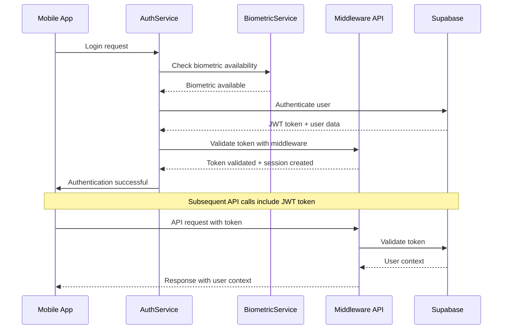

# **Payvo Middleware Testing Application**

**Internal React Native Testing App for Payvo AI Employees**

A comprehensive React Native mobile application designed specifically for Payvo AI team members to test, validate, and demonstrate the **Payvo Middleware** system. This app provides a complete testing environment for **GPS-based merchant detection**, **real-time MCC prediction**, **intelligent payment routing**, **background location tracking**, and **authentication integration** with the middleware backend.

## **Testing Application Purpose**

This mobile application serves as an **internal testing platform** for Payvo AI employees to:

- **Validate Middleware APIs** - Test MCC prediction and merchant detection systems in real-world scenarios
- **Prototype Payment Features** - Experiment with location-based payment routing algorithms
- **Demonstrate Capabilities** - Showcase middleware functionality to stakeholders and potential partners
- **Validate User Experience** - Test mobile app integration patterns before production implementation
- **Performance Testing** - Monitor response times, accuracy rates, and system reliability
- **Edge Case Testing** - Validate system behavior in challenging conditions (poor GPS, offline scenarios, etc.)

### 🏢 **For Payvo AI Team**
This testing application is specifically designed for internal use by Payvo AI engineers, product managers, and stakeholders to validate middleware capabilities that will eventually power the consumer-facing Payvo application.

## **Payvo Middleware Testing Features**

### **Payment Intelligence Testing**
- **Real-time GPS Integration** - Test continuous location tracking with 3-5 second precision
- **Smart MCC Prediction** - Validate AI-powered merchant category prediction with 90%+ accuracy
- **Intelligent Card Routing** - Test context-aware payment method selection algorithms
- **Background Location Tracking** - Validate merchant pattern detection even when app is closed
- **Adaptive Radius System** - Test dynamic search radius optimization (1m to 10m)
- **Multi-API Integration** - Validate Google Places and Foursquare data aggregation

### **Authentication & Security Testing**
- **JWT Token Authentication** - Test secure token-based authentication with Supabase
- **Biometric Authentication** - Validate TouchID/FaceID integration for secure app access
- **Session Management** - Test automatic session refresh and secure token handling
- **User Profile Integration** - Validate complete user context in all transactions
- **Activity Logging** - Test comprehensive audit trails for all user actions
- **Role-based Access Control** - Validate granular permissions and access management

### **Advanced Location Services Testing**
- **High-Precision GPS** - Test sub-meter accuracy with GNSS corrections
- **Indoor Venue Mapping** - Validate WiFi/BLE-based indoor location detection
- **Geofencing** - Test smart boundary detection for merchant locations
- **Location History** - Validate persistent location analytics and patterns
- **Offline Capability** - Test location update queuing when network unavailable
- **Battery Optimization** - Validate smart power management for extended tracking

### **User Experience Testing**
- **Native Performance** - Test optimized React Native with native modules
- **Real-time Updates** - Validate WebSocket integration for live data streams
- **Intuitive Interface** - Test modern UI/UX with smooth animations
- **Comprehensive Analytics** - Validate detailed performance metrics and insights
- **Dark Mode Support** - Test system-aware theme switching
- **Accessibility** - Validate VoiceOver/TalkBack support and WCAG compliance

### **Home Screen** (`src/screens/home/HomeScreen.tsx`)
- **User Dashboard** - Personalized welcome with user context
- **Real-time Status** - Live connection to middleware backend
- **Quick Actions** - Fast access to payment, location, and settings
- **Recent Activity** - Last 10 transactions and location updates
- **Notifications** - Important alerts and system messages
- **Performance Metrics** - API response times and success rates

### **Authentication Screens**

#### **Login Screen** (`src/screens/auth/LoginScreen.tsx`)
- **Email/Password Login** - Traditional authentication method
- **Biometric Login** - TouchID/FaceID integration
- **Social Login** - Google/Apple sign-in options
- **Remember Me** - Secure session persistence
- **Forgot Password** - Password reset workflow

#### **Profile Screen** (`src/screens/auth/ProfileScreen.tsx`)
- **User Information** - Name, email, profile picture
- **Security Settings** - Password change, 2FA setup
- **Privacy Controls** - Data sharing preferences
- **Account Management** - Delete account, export data

### **Location Screens**

#### **Location Screen** (`src/screens/location/LocationScreen.tsx`)
- **Real-time GPS Display** - Current coordinates and address
- **Accuracy Indicator** - GPS signal strength and precision
- **Nearby Merchants** - Detected businesses within radius
- **Location History** - Previously visited locations
- **Manual Location** - Override GPS with manual entry

#### **Map Screen** (`src/screens/location/MapScreen.tsx`)
- **Interactive Map** - Real-time location with merchant markers
- **Geofences** - Visual representation of merchant boundaries
- **Route Tracking** - Movement patterns and paths
- **Venue Detection** - Indoor/outdoor location identification
- **Search Radius** - Adaptive radius visualization

#### **Background Location Demo** (`src/screens/location/BackgroundLocationDemo.tsx`)
- **Session Controls** - Start/stop/pause background tracking
- **Live Updates** - Real-time location and MCC predictions
- **Session Statistics** - Duration, locations captured, battery usage
- **Configuration Panel** - Adjust tracking parameters
- **Performance Metrics** - Accuracy, update frequency, errors

### **Payment Screens**

#### **Payment Screen** (`src/screens/payment/PaymentScreen.tsx`)
- **Card Selection** - Available payment methods and cards
- **Amount Entry** - Transaction amount with validation
- **Merchant Selection** - Choose or search for merchant
- **Security Options** - Biometric confirmation, PIN entry
- **Transaction Preview** - Review before confirmation

#### **Routing Screen** (`src/screens/payment/RoutingScreen.tsx`)
- **Routing Visualization** - Step-by-step routing process
- **Card Recommendations** - AI-suggested optimal cards
- **Success Probability** - Predicted transaction success rate
- **Route Analytics** - Historical routing performance
- **Manual Override** - Force specific card selection

#### **Transaction History** (`src/screens/payment/TransactionHistory.tsx`)
- **Transaction List** - Chronological transaction history
- **Filtering Options** - Date range, amount, merchant filters
- **Details View** - Comprehensive transaction information
- **Export Options** - CSV, PDF export functionality
- **Search** - Full-text search across transactions

### **Analytics Screens**

#### **Analytics Screen** (`src/screens/analytics/AnalyticsScreen.tsx`)
- **Performance Dashboard** - Key metrics and KPIs
- **MCC Accuracy** - Prediction accuracy over time
- **Location Analytics** - Most visited locations and patterns
- **Success Rates** - Transaction success by various dimensions
- **User Behavior** - App usage patterns and trends

#### **Metrics Screen** (`src/screens/analytics/MetricsScreen.tsx`)
- **Real-time Metrics** - Live performance indicators
- **Historical Trends** - Performance over time
- **Comparison Charts** - Period-over-period analysis
- **Custom Reports** - User-defined metric combinations
- **Data Export** - Export metrics for external analysis

### **Settings Screens**

#### **Settings Screen** (`src/screens/settings/SettingsScreen.tsx`)
- **Account Settings** - Profile management and preferences
- **Security Settings** - Authentication and privacy controls
- **Notification Settings** - Push notification preferences
- **App Preferences** - Theme, language, default behaviors
- **Data Management** - Cache clearing, storage usage

#### **Preferences Screen** (`src/screens/settings/PreferencesScreen.tsx`)
- **Location Preferences** - GPS accuracy and update frequency
- **Payment Preferences** - Default cards and payment methods
- **Privacy Preferences** - Data collection and sharing settings
- **Accessibility** - Font size, voice over, high contrast
- **Developer Options** - Debug mode, API endpoints, logging

### **Background Location Tracking System**

#### **Validation Testing**

**1. BackgroundLocationService** (`src/services/location/BackgroundLocationService.ts`)
```typescript
export class BackgroundLocationService {
  // Session management
  async startTracking(config: BackgroundTrackingConfig): Promise<string>
  async stopTracking(): Promise<void>
  async pauseTracking(): Promise<void>
  async resumeTracking(): Promise<void>
  
  // Location updates
  async updateLocation(location: LocationData): Promise<void>
  async batchUpdateLocations(locations: LocationData[]): Promise<void>
  
  // MCC prediction
  async predictMCC(location: LocationData): Promise<MCCPrediction>
  async getOptimalMCC(): Promise<OptimalMCCResult>
  
  // Session monitoring
  getCurrentSession(): Promise<TrackingSession | null>
  getSessionStatistics(): Promise<SessionStats>
  
  // Battery optimization
  optimizeBatteryUsage(): void
  adjustUpdateFrequency(batteryLevel: number): void
}
```

#### **Demonstration Platform**

**2. useBackgroundLocation Hook** (`src/hooks/location/useBackgroundLocation.ts`)
```typescript
export const useBackgroundLocation = (userId: string, config: BackgroundTrackingConfig) => {
  const [isTracking, setIsTracking] = useState(false);
  const [currentSession, setCurrentSession] = useState<TrackingSession | null>(null);
  const [recentPredictions, setRecentPredictions] = useState<MCCPrediction[]>([]);
  const [sessionStats, setSessionStats] = useState<SessionStats | null>(null);
  
  const startTracking = useCallback(async () => {
    const sessionId = await backgroundLocationService.startTracking(config);
    setIsTracking(true);
    return sessionId;
  }, [config]);
  
  const stopTracking = useCallback(async () => {
    await backgroundLocationService.stopTracking();
    setIsTracking(false);
  }, []);
  
  const getOptimalMCC = useCallback(async () => {
    return backgroundLocationService.getOptimalMCC();
  }, []);
  
  return {
    isTracking,
    currentSession,
    recentPredictions,
    sessionStats,
    startTracking,
    stopTracking,
    getOptimalMCC
  };
};
```

#### **Development Support**

**Feature Prototyping** - Test new middleware features before production implementation
**User Experience Validation** - Refine mobile app patterns for consumer application
**Performance Optimization** - Identify bottlenecks and optimization opportunities
**Security Testing** - Validate authentication and data protection mechanisms

### **Internal Use Only**

**Important**: This testing application is designed exclusively for **Payvo AI employees** and **authorized stakeholders**. It provides comprehensive access to:

- **Live Middleware APIs** - Direct access to production-ready backend systems
- **Internal Analytics** - Detailed performance metrics and system insights
- **Development Tools** - Debug interfaces and testing utilities
- **Sensitive Data** - User profiles, transaction patterns, and business metrics

### **Future Production Integration**

The patterns, APIs, and user experience elements validated through this testing platform will be integrated into the consumer-facing Payvo application, providing:

- **Proven Middleware Integration** - Battle-tested API communication patterns
- **Optimized User Flows** - Refined authentication and payment experiences  
- **Performance Benchmarks** - Established baselines for consumer app performance
- **Security Models** - Validated authentication and data protection approaches

---

## 📁 **Project Structure**

```
middleware-application/
├── src/
│   ├── components/              # Reusable UI components
│   │   ├── auth/               # Authentication components
│   │   │   ├── LoginForm.tsx
│   │   │   ├── BiometricAuth.tsx
│   │   │   └── ProtectedRoute.tsx
│   │   ├── location/           # Location-based components
│   │   │   ├── LocationCard.tsx
│   │   │   ├── LocationHistory.tsx
│   │   │   └── MapView.tsx
│   │   ├── payment/            # Payment components
│   │   │   ├── PaymentCard.tsx
│   │   │   ├── MCCDisplay.tsx
│   │   │   └── RoutingStatus.tsx
│   │   └── common/             # Common UI components
│   │       ├── Button.tsx
│   │       ├── Input.tsx
│   │       └── LoadingSpinner.tsx
│   ├── screens/                # Main application screens
│   │   ├── auth/               # Authentication screens
│   │   │   ├── LoginScreen.tsx
│   │   │   ├── RegisterScreen.tsx
│   │   │   └── ProfileScreen.tsx
│   │   ├── home/               # Home and dashboard
│   │   │   ├── HomeScreen.tsx
│   │   │   └── DashboardScreen.tsx
│   │   ├── location/           # Location services
│   │   │   ├── LocationScreen.tsx
│   │   │   ├── MapScreen.tsx
│   │   │   └── BackgroundLocationDemo.tsx
│   │   ├── payment/            # Payment features
│   │   │   ├── PaymentScreen.tsx
│   │   │   ├── RoutingScreen.tsx
│   │   │   └── TransactionHistory.tsx
│   │   ├── analytics/          # Analytics and metrics
│   │   │   ├── AnalyticsScreen.tsx
│   │   │   └── MetricsScreen.tsx
│   │   └── settings/           # App settings
│   │       ├── SettingsScreen.tsx
│   │       └── PreferencesScreen.tsx
│   ├── services/               # Core services and APIs
│   │   ├── auth/               # Authentication services
│   │   │   ├── AuthService.ts
│   │   │   ├── TokenManager.ts
│   │   │   └── BiometricService.ts
│   │   ├── api/                # API integration
│   │   │   ├── PayvoAPI.ts
│   │   │   ├── MiddlewareAPI.ts
│   │   │   └── NetworkService.ts
│   │   ├── location/           # Location services
│   │   │   ├── LocationService.ts
│   │   │   ├── BackgroundLocationService.ts
│   │   │   └── GeofencingService.ts
│   │   └── storage/            # Data persistence
│   │       ├── StorageService.ts
│   │       ├── SecureStorage.ts
│   │       └── CacheManager.ts
│   ├── navigation/             # Navigation configuration
│   │   ├── AppNavigator.tsx
│   │   ├── AuthNavigator.tsx
│   │   ├── TabNavigator.tsx
│   │   └── StackNavigator.tsx
│   ├── hooks/                  # Custom React hooks
│   │   ├── auth/               # Authentication hooks
│   │   │   ├── useAuth.ts
│   │   │   ├── useTokenRefresh.ts
│   │   │   └── useBiometric.ts
│   │   ├── location/           # Location hooks
│   │   │   ├── useLocation.ts
│   │   │   ├── useBackgroundLocation.ts
│   │   │   └── useGeofencing.ts
│   │   ├── api/                # API hooks
│   │   │   ├── usePayvoAPI.ts
│   │   │   ├── useMiddleware.ts
│   │   │   └── useNetworkState.ts
│   │   └── common/             # Common hooks
│   │       ├── useAsync.ts
│   │       ├── useDebounce.ts
│   │       └── useTheme.ts
│   ├── context/                # React context providers
│   │   ├── AuthContext.tsx
│   │   ├── LocationContext.tsx
│   │   ├── ThemeContext.tsx
│   │   └── NetworkContext.tsx
│   ├── types/                  # TypeScript definitions
│   │   ├── auth.ts
│   │   ├── api.ts
│   │   ├── location.ts
│   │   ├── payment.ts
│   │   └── navigation.ts
│   ├── utils/                  # Utility functions
│   │   ├── auth/               # Auth utilities
│   │   │   ├── tokenValidation.ts
│   │   │   └── biometricUtils.ts
│   │   ├── location/           # Location utilities
│   │   │   ├── gpsUtils.ts
│   │   │   └── distanceCalculation.ts
│   │   ├── formatting.ts
│   │   ├── validation.ts
│   │   └── constants.ts
│   ├── config/                 # Configuration files
│   │   ├── environment.ts
│   │   ├── api.ts
│   │   └── constants.ts
│   └── styles/                 # Global styles and themes
│       ├── themes/
│       │   ├── light.ts
│       │   └── dark.ts
│       ├── colors.ts
│       ├── typography.ts
│       └── spacing.ts
├── android/                    # Android-specific configuration
│   ├── app/
│   │   └── src/main/
│   │       ├── AndroidManifest.xml
│   │       └── java/com/payvomiddleware/
├── ios/                        # iOS-specific configuration
│   ├── PayvoMiddleware/
│   │   ├── Info.plist
│   │   └── PayvoMiddleware.entitlements
│   └── PayvoMiddleware.xcworkspace
├── __tests__/                  # Test files
│   ├── components/
│   ├── services/
│   ├── hooks/
│   └── utils/
├── assets/                     # Static assets
│   ├── images/
│   ├── icons/
│   └── fonts/
├── .env                        # Environment variables
├── package.json                # Dependencies and scripts
├── tsconfig.json              # TypeScript configuration
├── metro.config.js            # Metro bundler configuration
├── babel.config.js            # Babel configuration
├── jest.config.js             # Jest testing configuration
└── app.json                   # React Native configuration
```

---

## **Installation & Setup**

### **Prerequisites**
- **Node.js 18+** - JavaScript runtime
- **React Native CLI 12+** - React Native command line tools
- **Xcode 15+** (iOS development) - macOS only
- **Android Studio 2023+** (Android development)
- **CocoaPods 1.12+** (iOS dependencies) - macOS only
- **Java 17** - Required for Android development

### **Quick Start**

1. **Navigate to Application Directory:**
   ```bash
   cd middleware-application
   ```

2. **Install Dependencies:**
   ```bash
   npm install
   # or
   yarn install
   ```

3. **iOS Setup (macOS only):**
   ```bash
   cd ios && pod install && cd ..
   ```

4. **Configure Environment:**
   ```bash
   # Copy environment template
   cp .env.example .env
   # Edit .env with your configuration
   ```

5. **Start Metro Bundler:**
   ```bash
   npx react-native start
   ```

6. **Run the Application:**
   ```bash
   # iOS (requires macOS and Xcode)
   npx react-native run-ios
   
   # Android (requires Android Studio)
   npx react-native run-android
   ```

### **Environment Configuration**

Create a `.env` file in the project root:

```env
# Payvo Middleware API Configuration
API_BASE_URL=https://payvo-middleware-production.up.railway.app
API_VERSION=v1
API_TIMEOUT=30000
API_RETRY_ATTEMPTS=3

# Authentication Configuration
AUTH_DOMAIN=your-auth-domain.supabase.co
SUPABASE_URL=https://your-project.supabase.co
SUPABASE_ANON_KEY=your-supabase-anon-key
JWT_SECRET=your-jwt-secret-key

# Security Configuration
ENABLE_BIOMETRIC_AUTH=true
SESSION_TIMEOUT_MINUTES=30
TOKEN_REFRESH_THRESHOLD_MINUTES=5
SECURE_STORAGE_KEY_PREFIX=payvo_

# Location Services Configuration
LOCATION_ACCURACY=high
LOCATION_TIMEOUT=15000
BACKGROUND_LOCATION_ENABLED=true
GEOFENCING_ENABLED=true

# Background Location Tracking
BACKGROUND_UPDATE_INTERVAL=4000        # 4 seconds
BACKGROUND_MIN_DISTANCE=5              # 5 meters
BACKGROUND_SESSION_DURATION=30         # 30 minutes
BACKGROUND_ENABLE_WHEN_CLOSED=true
BACKGROUND_BATTERY_OPTIMIZATION=true

# Payment Configuration
PAYMENT_TIMEOUT=45000
PAYMENT_RETRY_ATTEMPTS=2
ENABLE_APPLE_PAY=true
ENABLE_GOOGLE_PAY=true

# Analytics & Monitoring
ENABLE_ANALYTICS=true
ENABLE_CRASH_REPORTING=true
ENABLE_PERFORMANCE_MONITORING=true
LOG_LEVEL=info

# Development Settings
DEBUG_MODE=false
MOCK_API=false
ENABLE_FLIPPER=true
ENABLE_REACTOTRON=false

# Feature Flags
ENABLE_DARK_MODE=true
ENABLE_OFFLINE_MODE=true
ENABLE_PUSH_NOTIFICATIONS=true
ENABLE_DEEP_LINKING=true
```

---

## **Authentication Integration**

### **Authentication Flow**



### **Key Authentication Components**

#### **1. AuthService** (`src/services/auth/AuthService.ts`)
```typescript
export class AuthService {
  // Authentication methods
  async login(email: string, password: string): Promise<AuthResult>
  async logout(): Promise<void>
  async refreshToken(): Promise<string>
  async validateToken(token: string): Promise<boolean>
  
  // User management
  async getCurrentUser(): Promise<User | null>
  async updateProfile(updates: Partial<UserProfile>): Promise<void>
  
  // Session management
  async createSession(): Promise<Session>
  async invalidateSession(): Promise<void>
}
```

#### **2. useAuth Hook** (`src/hooks/auth/useAuth.ts`)
```typescript
export const useAuth = () => {
  const {
    isAuthenticated,
    user,
    token,
    isLoading,
    error,
    login,
    logout,
    refreshToken,
    clearError
  } = useContext(AuthContext);
  
  return {
    isAuthenticated,
    user,
    token,
    isLoading,
    error,
    login,
    logout,
    refreshToken,
    clearError
  };
};
```

#### **3. Biometric Authentication** (`src/services/auth/BiometricService.ts`)
```typescript
export class BiometricService {
  async authenticateWithBiometrics(): Promise<BiometricResult> {
    try {
      const biometryType = await TouchID.isSupported();
      
      if (!biometryType) {
        throw new Error('Biometric authentication not available');
      }
      
      const result = await TouchID.authenticate(
        'Authenticate to access Payvo',
        {
          title: 'Payvo Authentication',
          imageColor: '#007AFF',
          imageErrorColor: '#FF0000',
          sensorDescription: 'Touch sensor',
          sensorErrorDescription: 'Failed',
          cancelText: 'Cancel',
          fallbackLabel: 'Use Password',
          unifiedErrors: false,
          passcodeFallback: true
        }
      );
      
      return { success: true, biometryType };
    } catch (error) {
      return { success: false, error: error.message };
    }
  }
}
```

### **Protected Routes Implementation**

```typescript
// src/components/auth/ProtectedRoute.tsx
export const ProtectedRoute: React.FC<ProtectedRouteProps> = ({
  children,
  requiredRole,
  fallback
}) => {
  const { isAuthenticated, user, isLoading } = useAuth();
  
  if (isLoading) {
    return <LoadingSpinner />;
  }
  
  if (!isAuthenticated) {
    return fallback || <LoginScreen />;
  }
  
  if (requiredRole && !user?.roles?.includes(requiredRole)) {
    return <UnauthorizedScreen />;
  }
  
  return <>{children}</>;
};
```

---

## **Core App Features & Screens**

### **Home Screen** (`src/screens/home/HomeScreen.tsx`)
- **User Dashboard** - Personalized welcome with user context
- **Real-time Status** - Live connection to middleware backend
- **Quick Actions** - Fast access to payment, location, and settings
- **Recent Activity** - Last 10 transactions and location updates
- **Notifications** - Important alerts and system messages
- **Performance Metrics** - API response times and success rates

### **Authentication Screens**

#### **Login Screen** (`src/screens/auth/LoginScreen.tsx`)
- **Email/Password Login** - Traditional authentication method
- **Biometric Login** - TouchID/FaceID integration
- **Social Login** - Google/Apple sign-in options
- **Remember Me** - Secure session persistence
- **Forgot Password** - Password reset workflow

#### **Profile Screen** (`src/screens/auth/ProfileScreen.tsx`)
- **User Information** - Name, email, profile picture
- **Security Settings** - Password change, 2FA setup
- **Privacy Controls** - Data sharing preferences
- **Account Management** - Delete account, export data

### **Location Screens**

#### **Location Screen** (`src/screens/location/LocationScreen.tsx`)
- **Real-time GPS Display** - Current coordinates and address
- **Accuracy Indicator** - GPS signal strength and precision
- **Nearby Merchants** - Detected businesses within radius
- **Location History** - Previously visited locations
- **Manual Location** - Override GPS with manual entry

#### **Map Screen** (`src/screens/location/MapScreen.tsx`)
- **Interactive Map** - Real-time location with merchant markers
- **Geofences** - Visual representation of merchant boundaries
- **Route Tracking** - Movement patterns and paths
- **Venue Detection** - Indoor/outdoor location identification
- **Search Radius** - Adaptive radius visualization

#### **Background Location Demo** (`src/screens/location/BackgroundLocationDemo.tsx`)
- **Session Controls** - Start/stop/pause background tracking
- **Live Updates** - Real-time location and MCC predictions
- **Session Statistics** - Duration, locations captured, battery usage
- **Configuration Panel** - Adjust tracking parameters
- **Performance Metrics** - Accuracy, update frequency, errors

### **Payment Screens**

#### **Payment Screen** (`src/screens/payment/PaymentScreen.tsx`)
- **Card Selection** - Available payment methods and cards
- **Amount Entry** - Transaction amount with validation
- **Merchant Selection** - Choose or search for merchant
- **Security Options** - Biometric confirmation, PIN entry
- **Transaction Preview** - Review before confirmation

#### **Routing Screen** (`src/screens/payment/RoutingScreen.tsx`)
- **Routing Visualization** - Step-by-step routing process
- **Card Recommendations** - AI-suggested optimal cards
- **Success Probability** - Predicted transaction success rate
- **Route Analytics** - Historical routing performance
- **Manual Override** - Force specific card selection

#### **Transaction History** (`src/screens/payment/TransactionHistory.tsx`)
- **Transaction List** - Chronological transaction history
- **Filtering Options** - Date range, amount, merchant filters
- **Details View** - Comprehensive transaction information
- **Export Options** - CSV, PDF export functionality
- **Search** - Full-text search across transactions

### **Analytics Screens**

#### **Analytics Screen** (`src/screens/analytics/AnalyticsScreen.tsx`)
- **Performance Dashboard** - Key metrics and KPIs
- **MCC Accuracy** - Prediction accuracy over time
- **Location Analytics** - Most visited locations and patterns
- **Success Rates** - Transaction success by various dimensions
- **User Behavior** - App usage patterns and trends

#### **Metrics Screen** (`src/screens/analytics/MetricsScreen.tsx`)
- **Real-time Metrics** - Live performance indicators
- **Historical Trends** - Performance over time
- **Comparison Charts** - Period-over-period analysis
- **Custom Reports** - User-defined metric combinations
- **Data Export** - Export metrics for external analysis

### **Settings Screens**

#### **Settings Screen** (`src/screens/settings/SettingsScreen.tsx`)
- **Account Settings** - Profile management and preferences
- **Security Settings** - Authentication and privacy controls
- **Notification Settings** - Push notification preferences
- **App Preferences** - Theme, language, default behaviors
- **Data Management** - Cache clearing, storage usage

#### **Preferences Screen** (`src/screens/settings/PreferencesScreen.tsx`)
- **Location Preferences** - GPS accuracy and update frequency
- **Payment Preferences** - Default cards and payment methods
- **Privacy Preferences** - Data collection and sharing settings
- **Accessibility** - Font size, voice over, high contrast
- **Developer Options** - Debug mode, API endpoints, logging

---

## **Advanced Features**

### **Background Location Tracking System**

#### **Core Components**

**1. BackgroundLocationService** (`src/services/location/BackgroundLocationService.ts`)
```typescript
export class BackgroundLocationService {
  // Session management
  async startTracking(config: BackgroundTrackingConfig): Promise<string>
  async stopTracking(): Promise<void>
  async pauseTracking(): Promise<void>
  async resumeTracking(): Promise<void>
  
  // Location updates
  async updateLocation(location: LocationData): Promise<void>
  async batchUpdateLocations(locations: LocationData[]): Promise<void>
  
  // MCC prediction
  async predictMCC(location: LocationData): Promise<MCCPrediction>
  async getOptimalMCC(): Promise<OptimalMCCResult>
  
  // Session monitoring
  getCurrentSession(): Promise<TrackingSession | null>
  getSessionStatistics(): Promise<SessionStats>
  
  // Battery optimization
  optimizeBatteryUsage(): void
  adjustUpdateFrequency(batteryLevel: number): void
}
```

**2. useBackgroundLocation Hook** (`src/hooks/location/useBackgroundLocation.ts`)
```typescript
export const useBackgroundLocation = (userId: string, config: BackgroundTrackingConfig) => {
  const [isTracking, setIsTracking] = useState(false);
  const [currentSession, setCurrentSession] = useState<TrackingSession | null>(null);
  const [recentPredictions, setRecentPredictions] = useState<MCCPrediction[]>([]);
  const [sessionStats, setSessionStats] = useState<SessionStats | null>(null);
  
  const startTracking = useCallback(async () => {
    const sessionId = await backgroundLocationService.startTracking(config);
    setIsTracking(true);
    return sessionId;
  }, [config]);
  
  const stopTracking = useCallback(async () => {
    await backgroundLocationService.stopTracking();
    setIsTracking(false);
  }, []);
  
  const getOptimalMCC = useCallback(async () => {
    return backgroundLocationService.getOptimalMCC();
  }, []);
  
  return {
    isTracking,
    currentSession,
    recentPredictions,
    sessionStats,
    startTracking,
    stopTracking,
    getOptimalMCC
  };
};
```

### **Biometric Authentication**

#### **TouchID/FaceID Integration**
```typescript
// src/services/auth/BiometricService.ts
export class BiometricService {
  async authenticateWithBiometrics(): Promise<BiometricResult> {
    try {
      const biometryType = await TouchID.isSupported();
      
      if (!biometryType) {
        throw new Error('Biometric authentication not available');
      }
      
      const result = await TouchID.authenticate(
        'Authenticate to access Payvo',
        {
          title: 'Payvo Authentication',
          imageColor: '#007AFF',
          imageErrorColor: '#FF0000',
          sensorDescription: 'Touch sensor',
          sensorErrorDescription: 'Failed',
          cancelText: 'Cancel',
          fallbackLabel: 'Use Password',
          unifiedErrors: false,
          passcodeFallback: true
        }
      );
      
      return { success: true, biometryType };
    } catch (error) {
      return { success: false, error: error.message };
    }
  }
}
```

### **Offline Capability**

#### **Offline Queue Management**
```typescript
// src/services/storage/OfflineQueueService.ts
export class OfflineQueueService {
  async queueRequest(request: APIRequest): Promise<void>
  async processQueue(): Promise<void>
  async clearQueue(): Promise<void>
  getQueueSize(): Promise<number>
  
  // Auto-sync when network returns
  startAutoSync(): void
  stopAutoSync(): void
}
```

#### **Network State Management**
```typescript
// src/hooks/api/useNetworkState.ts
export const useNetworkState = () => {
  const [isConnected, setIsConnected] = useState(true);
  const [networkType, setNetworkType] = useState<string>('wifi');
  const [queueSize, setQueueSize] = useState(0);
  
  useEffect(() => {
    const unsubscribe = NetInfo.addEventListener(state => {
      setIsConnected(state.isConnected);
      setNetworkType(state.type);
      
      if (state.isConnected) {
        offlineQueueService.processQueue();
      }
    });
    
    return unsubscribe;
  }, []);
  
  return { isConnected, networkType, queueSize };
};
```

---

## **Performance & Analytics**

### **Real-time Metrics Dashboard**

#### **Performance Monitoring**
```typescript
// src/services/analytics/PerformanceService.ts
export class PerformanceService {
  trackAPICall(endpoint: string, duration: number, success: boolean): void
  trackLocationUpdate(accuracy: number, batteryUsage: number): void
  trackMCCPrediction(mcc: string, confidence: number, actual?: string): void
  trackUserAction(action: string, screen: string, duration?: number): void
  
  getPerformanceReport(): Promise<PerformanceReport>
  exportMetrics(format: 'csv' | 'json'): Promise<string>
}
```

#### **Analytics Integration**
```typescript
// src/hooks/analytics/useAnalytics.ts
export const useAnalytics = () => {
  const trackScreen = useCallback((screenName: string) => {
    analytics.track('screen_view', {
      screen_name: screenName,
      timestamp: Date.now()
    });
  }, []);
  
  const trackEvent = useCallback((event: string, properties?: Record<string, any>) => {
    analytics.track(event, {
      ...properties,
      user_id: user?.id,
      session_id: sessionId,
      timestamp: Date.now()
    });
  }, [user, sessionId]);
  
  return { trackScreen, trackEvent };
};
```

### **Battery Optimization**

#### **Smart Power Management**
```typescript
// src/services/location/BatteryOptimizationService.ts
export class BatteryOptimizationService {
  adjustLocationFrequency(batteryLevel: number): LocationConfig {
    if (batteryLevel < 20) {
      return { updateInterval: 10000, accuracy: 'low' }; // 10 seconds, low accuracy
    } else if (batteryLevel < 50) {
      return { updateInterval: 6000, accuracy: 'medium' }; // 6 seconds, medium accuracy
    } else {
      return { updateInterval: 4000, accuracy: 'high' }; // 4 seconds, high accuracy
    }
  }
  
  optimizeBackgroundTasks(): void {
    // Reduce background processing based on battery level
    // Prioritize critical tasks only
  }
}
```

---

## **Testing & Development**

### **Test Configuration**

#### **Jest Setup** (`jest.config.js`)
```javascript
module.exports = {
  preset: 'react-native',
  setupFilesAfterEnv: ['<rootDir>/src/test/setup.ts'],
  testMatch: ['**/__tests__/**/*.test.{ts,tsx}'],
  collectCoverageFrom: [
    'src/**/*.{ts,tsx}',
    '!src/**/*.d.ts',
    '!src/test/**/*',
  ],
  coverageThreshold: {
    global: {
      branches: 80,
      functions: 80,
      lines: 80,
      statements: 80,
    },
  },
};
```

#### **Test Examples**

**Authentication Service Test**
```typescript
// __tests__/services/AuthService.test.ts
describe('AuthService', () => {
  let authService: AuthService;
  
  beforeEach(() => {
    authService = new AuthService();
  });
  
  describe('login', () => {
    it('should authenticate user successfully', async () => {
      const result = await authService.login('test@example.com', 'password');
      expect(result.success).toBe(true);
      expect(result.token).toBeDefined();
    });
    
    it('should handle invalid credentials', async () => {
      await expect(
        authService.login('invalid@example.com', 'wrong')
      ).rejects.toThrow('Invalid credentials');
    });
  });
});
```

**Location Service Test**
```typescript
// __tests__/services/LocationService.test.ts
describe('LocationService', () => {
  let locationService: LocationService;
  
  beforeEach(() => {
    locationService = new LocationService();
  });
  
  describe('getCurrentLocation', () => {
    it('should return current location', async () => {
      const location = await locationService.getCurrentLocation();
      expect(location.latitude).toBeDefined();
      expect(location.longitude).toBeDefined();
      expect(location.accuracy).toBeGreaterThan(0);
    });
  });
});
```

### **Development Scripts**

```json
{
  "scripts": {
    "start": "react-native start",
    "ios": "react-native run-ios",
    "android": "react-native run-android",
    "test": "jest",
    "test:watch": "jest --watch",
    "test:coverage": "jest --coverage",
    "lint": "eslint src --ext .ts,.tsx",
    "lint:fix": "eslint src --ext .ts,.tsx --fix",
    "type-check": "tsc --noEmit",
    "build:ios": "react-native run-ios --configuration Release",
    "build:android": "cd android && ./gradlew assembleRelease",
    "clean": "react-native clean-project-auto",
    "pod-install": "cd ios && pod install",
    "postinstall": "cd ios && pod install"
  }
}
```

### **Debug Configuration**

#### **React Native Debugger**
```typescript
// src/config/debugger.ts
if (__DEV__) {
  import('../../../ReactotronConfig').then(() => console.log('Reactotron Configured'));
}
```

#### **Flipper Integration**
```typescript
// src/config/flipper.ts
import { logger } from 'react-native-logs';

const defaultConfig = {
  severity: __DEV__ ? 'debug' : 'error',
  transport: __DEV__ ? logger.consoleTransport : logger.fileAsyncTransport,
  transportOptions: {
    colors: {
      info: 'blueBright',
      warn: 'yellowBright',
      error: 'redBright',
    },
  },
};

export const log = logger.createLogger(defaultConfig);
```

---

## **Troubleshooting**

### **Common Issues & Solutions**

#### **1. Authentication Issues**

**Token Expired**
```typescript
// Check token validity
const isValid = await authService.validateToken();
if (!isValid) {
  await authService.refreshToken();
}
```

**Biometric Not Working**
```bash
# iOS: Check Face ID settings
Settings > Face ID & Passcode > Other Apps > Payvo

# Android: Check biometric settings
Settings > Security > Biometrics
```

#### **2. Location Services Issues**

**GPS Not Working**
```typescript
// Check location permissions
const hasPermission = await LocationService.hasPermission();
if (!hasPermission) {
  await LocationService.requestPermission();
}
```

**Background Tracking Stops**
```bash
# iOS: Enable background app refresh
Settings > General > Background App Refresh > Payvo

# Android: Disable battery optimization
Settings > Apps > Payvo > Battery > Don't optimize
```

#### **3. API Connection Issues**

**Network Connectivity**
```typescript
// Test API connectivity
const healthCheck = await payvoAPI.healthCheck();
console.log('API Status:', healthCheck.status);
```

**SSL Certificate Issues**
```typescript
// For development only - disable SSL verification
const developmentConfig = {
  trustInvalidCerts: __DEV__,
  timeout: 30000
};
```

### **Debug Tools & Utilities**

#### **Debug Menu** (Development builds only)
- **Shake device** → Access debug menu
- **Network Inspector** → View API calls
- **Location Simulator** → Test with fake GPS
- **Token Inspector** → View current authentication state

#### **Logging Configuration**
```typescript
// src/utils/logger.ts
export const logger = {
  debug: (message: string, data?: any) => {
    if (__DEV__) {
      console.log(`[DEBUG] ${message}`, data);
    }
  },
  error: (message: string, error?: Error) => {
    console.error(`[ERROR] ${message}`, error);
    // Send to crash reporting service
  }
};
```

---

## **Support & Documentation**

### **Getting Help**

- **In-App Support** - Access help via Settings → Support
- **Documentation** - Comprehensive guides in the app
- **Performance Issues** - Check Analytics screen for diagnostics
- **Error Logs** - Enable debug mode for detailed logging

### **Performance Monitoring**

```typescript
// Real-time performance metrics
const performanceMetrics = {
  apiResponseTime: '< 200ms average',
  locationAccuracy: '1-10 meters',
  batteryUsage: '< 5% per hour',
  mccPredictionAccuracy: '90%+',
  backgroundSessionDuration: '30 minutes',
  offlineQueueCapacity: '100 requests'
};
```

### **Feature Status**

**Authentication System** - Complete with biometric support  
**Background Location Tracking** - Real-time with battery optimization  
**MCC Prediction** - AI-powered with 90%+ accuracy  
**Payment Routing** - Intelligent card selection  
**Offline Capability** - Queue and sync when online  
**Analytics & Metrics** - Comprehensive performance tracking  
**Security & Privacy** - Enterprise-grade protection  
**Cross-platform** - iOS and Android support  

## **Internal Testing Platform**

### **For Payvo AI Team Members**

This React Native application serves as the **primary testing interface** for validating the Payvo Middleware system before production deployment. Key testing capabilities include:

#### **Validation Testing**
- **API Endpoint Testing** - Validate all middleware endpoints with real mobile scenarios
- **Performance Benchmarking** - Monitor response times, accuracy rates, and system reliability
- **Integration Testing** - Test seamless communication between mobile app and middleware
- **Edge Case Validation** - Test system behavior under challenging conditions

#### **Demonstration Platform**
- **Stakeholder Demos** - Showcase middleware capabilities to investors and partners
- **Product Validation** - Demonstrate payment intelligence features to potential customers
- **Technical Showcases** - Present system architecture and performance to technical audiences
- **Business Case Development** - Generate metrics and analytics for business decisions

#### **Development Support**
- **Feature Prototyping** - Test new middleware features before production implementation
- **User Experience Validation** - Refine mobile app patterns for consumer application
- **Performance Optimization** - Identify bottlenecks and optimization opportunities
- **Security Testing** - Validate authentication and data protection mechanisms

### **Internal Use Only**

**Important**: This testing application is designed exclusively for **Payvo AI employees** and **authorized stakeholders**. It provides comprehensive access to:

- **Live Middleware APIs** - Direct access to production-ready backend systems
- **Internal Analytics** - Detailed performance metrics and system insights
- **Development Tools** - Debug interfaces and testing utilities
- **Sensitive Data** - User profiles, transaction patterns, and business metrics

### **Future Production Integration**

The patterns, APIs, and user experience elements validated through this testing platform will be integrated into the consumer-facing Payvo application, providing:

- **Proven Middleware Integration** - Battle-tested API communication patterns
- **Optimized User Flows** - Refined authentication and payment experiences  
- **Performance Benchmarks** - Established baselines for consumer app performance
- **Security Models** - Validated authentication and data protection approaches