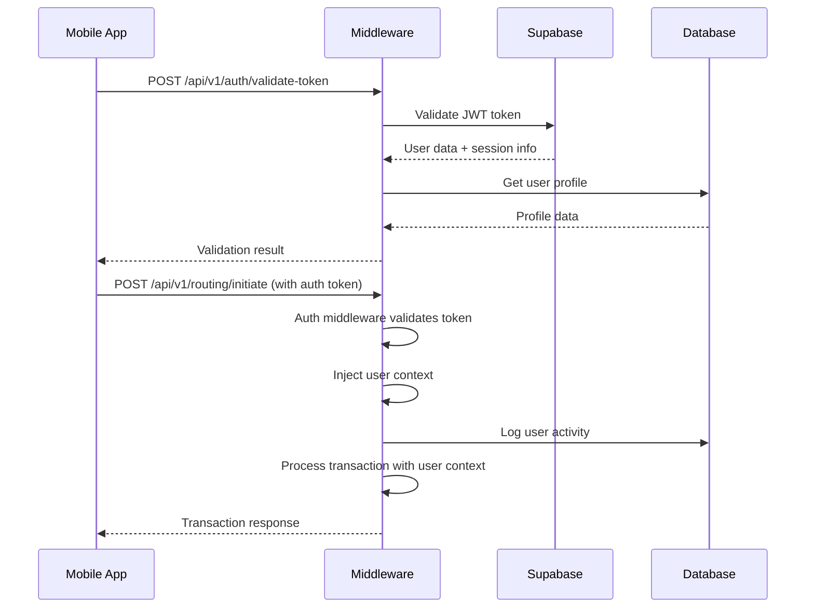

# **Payvo Middleware System - Complete Backend API**

A high-performance FastAPI middleware for intelligent payment routing with GPS-first MCC prediction, enhanced location-based merchant categorization, continuous background location tracking, and comprehensive user authentication system.

## **Core Features**

### **Payment Intelligence**
- **GPS-First MCC Prediction** - Advanced merchant category prediction using location data
- **Enhanced Location Routing** - Multi-tier location analysis with indoor venue mapping
- **Real-time Decision Engine** - Intelligent card routing based on context and performance
- **Hierarchical Location Detection** - From precise GPS to building-level to area predictions
- **Indoor Mapping Support** - WiFi/BLE context for venue-specific routing
- **Adaptive Radius System** - Intelligent search radius optimization (1m to 10m)

### **Authentication & Security**
- **Token-based Authentication** - JWT + Custom session tokens
- **User Context Injection** - Into all transaction processing
- **Activity Logging** - Comprehensive audit trails
- **Role-based Access Control** - RBAC with granular permissions
- **Session Management** - Secure session tracking with Supabase
- **Backward Compatibility** - Maintains existing transaction flows

### **Background Services**
- **Background Location Tracking** - Continuous location monitoring with 3-5 second intervals
- **Smart Session Management** - Automatic session creation and lifecycle management
- **Multi-API Integration** - Google Places and Foursquare data aggregation
- **Comprehensive Logging** - Detailed request/response logging with performance metrics

### **Technical Foundation**
- **FastAPI Framework** - High-performance async API with automatic documentation
- **Supabase Integration** - Scalable PostgreSQL database with real-time capabilities
- **Redis Caching** - In-memory caching for session management and performance
- **Background Processing** - Continuous location analytics and MCC prediction
- **Health Monitoring** - Built-in health checks and system status endpoints
- **Docker Ready** - Containerized deployment with optimized configuration

---

## 📁 **Directory Structure**

```
middleware-system/
├── app/
│   ├── main.py                     # FastAPI application entry point
│   ├── api/
│   │   ├── routes.py              # Main API route definitions
│   │   └── route_modules/
│   │       ├── auth.py            # Authentication API endpoints
│   │       ├── background_location.py # Background location API
│   │       └── mcc_prediction.py  # MCC prediction endpoints
│   ├── core/
│   │   └── config.py              # Configuration management
│   ├── database/
│   │   ├── connection_manager.py   # Database connection handling
│   │   ├── models.py              # Database models
│   │   ├── schema.sql             # Database schema definitions
│   │   └── supabase_client.py     # Supabase client wrapper
│   ├── middleware/
│   │   └── auth_middleware.py     # Authentication middleware
│   ├── models/
│   │   └── schemas.py             # Pydantic models for API
│   └── services/
│       ├── auth_service.py        # Authentication service
│       ├── ai_inference.py        # AI/ML inference engine
│       ├── card_routing.py        # Card routing logic
│       ├── context_collector.py   # Context collection service
│       ├── learning_engine.py     # Machine learning engine
│       ├── location_service.py    # Location processing service
│       ├── mcc_prediction.py      # MCC prediction service
│       ├── routing_orchestrator.py # Main routing orchestrator
│       └── token_provisioning.py  # Token provisioning service
├── database-functions/
│   └── user_lookup.sql            # Supabase database functions
├── requirements.txt               # Python dependencies
├── .env                          # Environment variables
├── run.py                        # Development server runner
├── test_enhanced_mcc.py          # MCC prediction tests
├── test_installation.py         # Installation verification
├── simulate_real_transactions.py # Transaction simulation
└── supabase_schema.sql           # Supabase database schema
```

---

## **Installation & Setup**

### **Prerequisites**
- Python 3.11+
- Redis Server
- Supabase Account

### **Quick Start**

1. **Clone and Navigate:**
   ```bash
   cd middleware-system
   ```

2. **Create Virtual Environment:**
   ```bash
   python -m venv venv
   source venv/bin/activate  # Windows: venv\Scripts\activate
   ```

3. **Install Dependencies:**
   ```bash
   pip install -r requirements.txt
   ```

4. **Configure Environment:**
   ```bash
   cp .env.example .env
   # Edit .env with your configuration
   ```

5. **Setup Database:**
   ```bash
   # Execute the user lookup function in Supabase
   psql -h your-supabase-host -d postgres -f database-functions/user_lookup.sql
   ```

6. **Start the Server:**
   ```bash
   python app/main.py
   # Or for development:
   uvicorn app.main:app --reload --host 0.0.0.0 --port 8000
   ```

### **Environment Variables**

Create a `.env` file with the following configuration:

```env
# Supabase Configuration
SUPABASE_URL=https://your-project.supabase.co
SUPABASE_ANON_KEY=your-supabase-anon-key
SUPABASE_SERVICE_ROLE_KEY=your-supabase-service-role-key

# Security
PAYVO_SECRET_KEY=your-secret-key-for-jwt-signing
SECRET_KEY=your-secret-key-here
ALGORITHM=HS256
ACCESS_TOKEN_EXPIRE_MINUTES=30

# Redis Configuration
REDIS_URL=redis://localhost:6379
REDIS_PASSWORD=your-redis-password

# Application Settings
DEBUG=true
LOG_LEVEL=INFO
API_VERSION=v1
MAX_WORKERS=4

# External APIs
OPENAI_API_KEY=your-openai-key  # Optional for AI features
GOOGLE_PLACES_API_KEY=your-google-places-api-key
FOURSQUARE_API_KEY=your-foursquare-api-key

# Enhanced MCC Prediction Configuration
GOOGLE_PLACES_ENABLED=true
GOOGLE_PLACES_RADIUS_METERS=200
GOOGLE_PLACES_MAX_RESULTS=20

FOURSQUARE_ENABLED=true
FOURSQUARE_RADIUS_METERS=200
FOURSQUARE_MAX_RESULTS=20

# Service Feature Flags
ENHANCED_LOCATION_ENABLED=true
ENHANCED_TERMINAL_ENABLED=true
ENHANCED_FINGERPRINT_ENABLED=true
ENHANCED_HISTORICAL_ENABLED=true

# Confidence Thresholds
MIN_LOCATION_CONFIDENCE=0.5
MIN_TERMINAL_CONFIDENCE=0.6
MIN_FINGERPRINT_CONFIDENCE=0.4
MIN_HISTORICAL_CONFIDENCE=0.5

# Analysis Settings
DEFAULT_SEARCH_RADIUS_METERS=200
MAX_SEARCH_RADIUS_METERS=1000
MIN_SEARCH_RADIUS_METERS=50

# Cache TTL (hours)
LOCATION_CACHE_TTL_HOURS=24
TERMINAL_CACHE_TTL_HOURS=12
FINGERPRINT_CACHE_TTL_HOURS=6
HISTORICAL_CACHE_TTL_HOURS=1

# Prediction Weights
LOCATION_WEIGHT=0.35
HISTORICAL_WEIGHT=0.25
TERMINAL_WEIGHT=0.20
WIFI_WEIGHT=0.10
BLE_WEIGHT=0.10
```

---

## **Authentication System**

### **Architecture Components**

#### **1. Authentication Service** (`app/services/auth_service.py`)
- **Token validation** (JWT and custom session tokens)
- **User profile management** with Supabase integration
- **Session tracking** and activity logging
- **Anonymous user contexts** for backward compatibility

#### **2. Authentication Middleware** (`app/middleware/auth_middleware.py`)
- **Request interception** and token validation
- **User context injection** into request state
- **Protected route enforcement**
- **Activity logging** for API access

#### **3. Authentication API** (`app/api/route_modules/auth.py`)
- **Token validation endpoints** for mobile app
- **User profile access** and session management
- **Transaction context creation** for legacy compatibility
- **Activity logging endpoints**

#### **4. Database Integration**
- **User lookup functions** (`database-functions/user_lookup.sql`)
- **Activity logging** via `user_activity_logs` table
- **Session management** via `user_sessions` table

### **Protected Routes**

The following routes require authentication:
- `/api/v1/transactions`
- `/api/v1/balance`
- `/api/v1/history`
- `/api/v1/user`
- `/api/v1/accounts`
- `/api/v1/profile`

### **Role-Based Access Control**

```python
# Require specific roles
@router.get("/admin/dashboard")
async def admin_dashboard(user: AuthUser = Depends(require_role(["admin", "manager"]))):
    # Only admin or manager roles can access
    pass
```

---

## **API Documentation**

### **Authentication Endpoints**

#### **Token Validation**
```bash
POST /api/v1/auth/validate-token
Content-Type: application/json

{
  "token": "your_jwt_token_here"
}
```

#### **User Profile**
```bash
GET /api/v1/auth/profile
Authorization: Bearer your_token_here
```

#### **Session Information**
```bash
GET /api/v1/auth/session
Authorization: Bearer your_token_here
```

#### **User Lookup (Legacy)**
```bash
POST /api/v1/auth/lookup-user
Content-Type: application/json

{
  "email": "user@example.com"
}
```

#### **Transaction Context**
```bash
POST /api/v1/auth/transaction-context
Content-Type: application/json

{
  "user_email": "user@example.com",
  "transaction_id": "tx_123",
  "metadata": {"key": "value"}
}
```

### **Core Payment Routing**

#### **Initiate Routing Session**
```bash
POST /api/v1/routing/initiate
Authorization: Bearer your_token_here
Content-Type: application/json

{
  "user_id": "user@example.com",
  "platform": "ios",
  "wallet_type": "apple_pay",
  "transaction_amount": 25.50,
  "device_id": "device_123"
}
```

#### **Activate Payment**
```bash
POST /api/v1/routing/{session_id}/activate
Authorization: Bearer your_token_here
Content-Type: application/json

{
  "location": {
    "latitude": 40.7128,
    "longitude": -74.0060,
    "accuracy": 10.0,
    "source": "gps"
  },
  "terminal_id": "term_123",
  "merchant_name": "Coffee Shop",
  "wifi_networks": [
    {
      "ssid": "CoffeeShop_WiFi",
      "bssid": "00:11:22:33:44:55",
      "signal_strength": -45
    }
  ],
  "ble_beacons": [
    {
      "uuid": "550e8400-e29b-41d4-a716-446655440000",
      "major": 1,
      "minor": 2,
      "rssi": -65
    }
  ],
  "amount": 15.99
}
```

#### **Complete Transaction**
```bash
POST /api/v1/routing/{session_id}/complete
Authorization: Bearer your_token_here
Content-Type: application/json

{
  "feedback": {
    "actual_mcc": "5812",
    "transaction_success": true,
    "merchant_name": "Starbucks",
    "transaction_amount": 15.99,
    "prediction_accuracy": 1.0
  }
}
```

### **Background Location Tracking**

#### **Start Background Session**
```bash
POST /api/v1/background-location/start
Authorization: Bearer your_token_here
Content-Type: application/json

{
  "user_id": "user@example.com",
  "session_duration_minutes": 30,
  "update_interval_seconds": 4
}
```

#### **Update Location**
```bash
POST /api/v1/background-location/update
Authorization: Bearer your_token_here
Content-Type: application/json

{
  "session_id": "bg_session_123",
  "location": {
    "latitude": 40.7128,
    "longitude": -74.0060,
    "accuracy": 5.0,
    "timestamp": "2024-01-01T12:00:00Z"
  },
  "mcc_prediction": {
    "mcc": "5812",
    "confidence": 0.95,
    "method": "gps_places"
  }
}
```

### **Health & Monitoring**

#### **System Health**
```bash
GET /api/v1/health
GET /api/v1/auth/status
```

#### **Performance Metrics**
```bash
GET /api/v1/metrics
Authorization: Bearer your_token_here
```

---

## **Mobile App Integration**

### **Authentication Headers**

Include authentication tokens in API requests:

```typescript
// Using Authorization header (preferred)
const headers = {
    'Authorization': `Bearer ${userToken}`,
    'Content-Type': 'application/json'
};

// Or using custom header
const headers = {
    'X-Auth-Token': userToken,
    'Content-Type': 'application/json'
};
```

### **Token Validation**

```typescript
const validateToken = async (token: string) => {
    const response = await fetch('/api/v1/auth/validate-token', {
        method: 'POST',
        headers: { 'Content-Type': 'application/json' },
        body: JSON.stringify({ token })
    });
    
    const result = await response.json();
    return result.is_valid;
};
```

### **User Profile Access**

```typescript
const getUserProfile = async (token: string) => {
    const response = await fetch('/api/v1/auth/profile', {
        headers: { 'Authorization': `Bearer ${token}` }
    });
    
    return response.json();
};
```

### **Authenticated Payment Flow**

```typescript
// 1. Validate token
const isValid = await validateToken(userToken);

// 2. Initiate routing
const session = await fetch('/api/v1/routing/initiate', {
    method: 'POST',
    headers: {
        'Authorization': `Bearer ${userToken}`,
        'Content-Type': 'application/json'
    },
    body: JSON.stringify({
        user_id: userEmail,
        platform: 'ios',
        wallet_type: 'apple_pay',
        transaction_amount: 25.99
    })
});

// 3. Activate with location
const activation = await fetch(`/api/v1/routing/${sessionId}/activate`, {
    method: 'POST',
    headers: {
        'Authorization': `Bearer ${userToken}`,
        'Content-Type': 'application/json'
    },
    body: JSON.stringify({
        location: {
            latitude: currentLocation.latitude,
            longitude: currentLocation.longitude,
            accuracy: 10.0
        },
        amount: 25.99
    })
});
```

---

## **Integration Flow**

### **Mobile App → Middleware Authentication**



### **Transaction Processing with Authentication**

```python
# In routing_orchestrator.py
async def initiate_routing(self, user_id: str, ...):
    # Create user context for transaction
    user_context = await create_transaction_context(user_id)
    
    # Include in session data
    session_data = {
        "user_context": user_context,
        "is_authenticated": user_context["is_authenticated"],
        # ... other session data
    }
    
    # Log activity for authenticated users
    if user_context["is_authenticated"]:
        await auth_service.log_user_activity(
            user_id=user_context["user_id"],
            action="transaction_initiated",
            resource="payment_routing"
        )
```

---

## **Testing & Validation**

### **Health Check with Auth Status**
```bash
curl -X GET http://localhost:8000/api/v1/auth/status \
  -H "Authorization: Bearer YOUR_TOKEN"
```

### **Token Validation Test**
```bash
curl -X POST http://localhost:8000/api/v1/auth/validate-token \
  -H "Content-Type: application/json" \
  -d '{"token": "YOUR_JWT_TOKEN"}'
```

### **Authenticated Transaction Test**
```bash
curl -X POST http://localhost:8000/api/v1/routing/initiate \
  -H "Authorization: Bearer YOUR_TOKEN" \
  -H "Content-Type: application/json" \
  -d '{
    "user_id": "user@example.com",
    "platform": "ios", 
    "wallet_type": "apple_pay",
    "transaction_amount": 25.99
  }'
```

### **GPS Payment Test**
```bash
curl -X POST http://localhost:8000/api/v1/test/gps-payment \
  -H "Content-Type: application/json" \
  -d '{
    "user_id": "test@example.com",
    "latitude": 40.7128,
    "longitude": -74.0060,
    "platform": "ios",
    "wallet_type": "apple_pay",
    "amount": 50.0
  }'
```

---

## **Monitoring & Analytics**

### **Activity Logs Query**
```sql
SELECT 
    ual.action,
    ual.resource,
    ual.created_at,
    up.email,
    up.full_name
FROM user_activity_logs ual
JOIN user_profiles up ON ual.user_id = up.id
WHERE ual.created_at >= NOW() - INTERVAL '24 hours'
ORDER BY ual.created_at DESC;
```

### **Session Analytics**
```sql
SELECT 
    COUNT(*) as active_sessions,
    COUNT(DISTINCT user_id) as unique_users
FROM user_sessions 
WHERE is_active = true 
AND expires_at > NOW();
```

---

## **Future Enhancements**

1. **Multi-factor Authentication (MFA)**
2. **OAuth integration** (Google, Apple, etc.)
3. **Rate limiting** per user/role
4. **Session clustering** for scalability
5. **Advanced audit logging** with data classification
6. **API key authentication** for service-to-service calls
7. **Enhanced indoor positioning** with advanced fingerprinting
8. **Machine learning model improvements** for MCC prediction
9. **Real-time merchant data updates**
10. **Advanced fraud detection** integration

---

## **Integration Summary**

**Complete authentication system** integrated with mobile app  
**User context** in all transaction processing  
**Activity logging** and audit trails  
**Backward compatibility** maintained  
**Role-based access control** implemented  
**Session management** with Supabase integration  
**API endpoints** for mobile app integration  
**Security middleware** protecting sensitive routes  
**GPS-first MCC prediction** with enhanced accuracy  
**Background location tracking** with intelligent intervals  
**Real-time payment routing** with context awareness  
**Comprehensive monitoring** and analytics